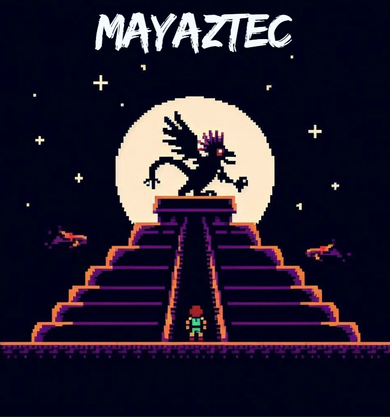

# **MayAztec: El Ascenso de la Lotería**
 

## _Game Design Document_

---

##### **Copyright notice / author information / boring legal stuff nobody likes**
###### Authors: 
- Mauricio Emilio Monroy González
- Hector Lugo
- Nicolas Quintana

##
## _Index_

---

1. [Index](#index)
2. [Game Design](#game-design)
    1. [Summary](#summary)
    2. [Gameplay](#gameplay)
    3. [Mindset](#mindset)
3. [Technical](#technical)
    1. [Screens](#screens)
    2. [Controls](#controls)
    3. [Mechanics](#mechanics)
4. [Level Design](#level-design)
    1. [Themes](#themes)
        1. Ambience
        2. Objects
            1. Ambient
            2. Interactive
        3. Challenges
    2. [Game Flow](#game-flow)
5. [Development](#development)
    1. [Abstract Classes](#abstract-classes--components)
    2. [Derived Classes](#derived-classes--component-compositions)
6. [Graphics](#graphics)
    1. [Style Attributes](#style-attributes)
    2. [Graphics Needed](#graphics-needed)
7. [Sounds/Music](#soundsmusic)
    1. [Style Attributes](#style-attributes-1)
    2. [Sounds Needed](#sounds-needed)
    3. [Music Needed](#music-needed)
8. [Schedule](#schedule)

## _Game Design_

---

### **Summary**
Embark on a thrilling journey through a mystical pyramid steeped in Aztec and Mayan mythology, infused with a contemporary Mexican flair. In this roguelite adventure, players must confront ancient gods in adrenaline-pumping battles, while discovering unique power-ups and abilities hidden within traditional lottery cards. Each card offers temporary, game-changing boosts, ensuring an ever-evolving and dynamic gameplay experience. Time runs out per level. The gods are waiting. Will you break the cycle of death and resurrection, or be trapped in the eternal curse forever?

### **Gameplay**
The player's character exists in a 2D world, based in an ancient pyramid vibe, with distinct levels that ensure no two experiences are the same. Each level will consist of randomly generated room layouts with enemies and reward chests, as well as a corresponding boss. To progress, the player must explore areas filled with a mix of challenging enemies, and collect cards that aid in their advancement before the alloted time per level runs out. In order to survive, the player will possess an "inventory" of 6 cards (1 permanent and 5 consumables), which will provide temporary but varied boosts in stats for combat or in weaponry. 

#### Game Objective
The objective is to gradually defeat the ancient gods and break their curses, in order to escape the infinite cycle of death and resurrection they've thrust yourself upon. At first, the task will seem daunting, but by gradually advancing, and gaining powerful weapons and powerups, little by little the player's knowledge, experience and abilities will grow. 

#### Obstacles and Challenges
In order to finish the game, a player would have to beat all the levels in a single, continuous attempt. The player must fight with enemies spawning randomly in randomly generated room layouts, as well as manage inventory consumables adequately and strategically. All cards act as consumables, some with more, some with less. Once a card's allowed uses are spent, the player must search for more (either through combat, since defeated enemies have a chance to drop a card, or  through exploring) to refill their acting inventory. Upon taking significant damage, the current "game run" will be over, and most of the player's progress will be lost, and they will have to traverse the levels from the beginning. They will only be able to start over with the last card they picked up from their previous life, along with a basic default card, forcing the player to repeatedly attempt to complete the game from scratch. Also, the gods provide a limited preparation time depending on each level as a challenge before facing them, allowing the player to explore the level, prepare their inventory with what they'd like to use for boss fights and choose which challenges to face. The greater the adventure, the better the reward.

#### Tactics & Strategies
The player will face 3 types of base-enemies in close-range combat, as well as boss fights. To overcome these obstacles, the player must experiment with different card usage, as well as find a balance on when to fight and when they decide they figure their inventory is just right for a boss fight, thus requiring a bit of exploring and combat to prepare. As they progress in further levels, the benefits reaped from the cards will increase as difficulty does, therefore providing better tools and advantages. Time and inventory management balanced will be of the essence.

### **Mindset**
The game is designed to be played with an adventure-oriented and reward-facing mindset toward the unknown, starting with just a base weapon but seeking to improve in a tense and challenging environment. The player must feel the curiosity to explore rooms and gain rewards along the way, but exercise caution due to the threat of going all-in with each enemy the player encounters. They must manage their inventory conservatively, sometimes with a bit of improvisation but always rushing to face the level's boss.

## _Technical_

---

### **Screens**
1. Title Screen
    1. Login
    2. Options
    3. Leaderboard
2. Game
    1. BaseCard Selection
    2. HUD Game
    3. Inventory
    4. Pause Menu
        1. In-Game Options
    5. Transition to next level
4. Death screen

### **Controls**

1. Movement
	1. W / Up Arrow key: player moves "upward"/north
    2. A / Left Arrow key: player moves left/west
    3. S / Down Arrow key: player moves "downwards"/south
    4. D / Right Arrow key: player moves right/east
Combining keys provides diagonal movement (ex. W+A results in a northeasth direction)  
2. Combat
	1. Attack with BaseCard: 
3. Lotería Cards Usage
	1. Special Ability Button / Q: Activate a selected card.
	2. Switch Card / E: Cycle through available cards.
4. Menus & Options
	1. Tab / Select
	3. Esc / Start: Pause the game and access settings.

### **Mechanics**

1. Lotería Card System (Dynamic Power-Ups)
	1. Players collect and activate Lotería cards for temporary or permanent abilities depending on the rewards given.
	2. Some cards give elemental effects (fire, wind, shadow, ice) or transformation abilities (e.g., El Mariachi grants a music-based attack).
lementation:
	Card Collection: Stored in an inventory system using an array.
	Effects Application: Each card applies a modifier to player stats using an event-driven system (e.g., attack power, speed boost).
	Procedural Spawning: Randomized card drops use probability weight tables to ensure variety in every drop.
2.  Multi-Phase Boss Fights (Soulslike & Zelda-Inspired)
	1. Bosses have multiple attack phases that change dynamically based on the health left.
Impletion:
	Finite-State Machines (FSM): Used to transition between attack patterns based on boss health/stamina.

## _Level Design_

---

_(Note : These sections can safely be skipped if they&#39;re not relevant, or you&#39;d rather go about it another way. For most games, at least one of them should be useful. But I&#39;ll understand if you don&#39;t want to use them. It&#39;ll only hurt my feelings a little bit.)_

### **Themes**

1. General
    1. Mood
2. Level 1 - "Nombre idk"
    1. Mood
        1. 
    2. Objects
        1. _Ambient_
            1. Fireflies
            2. Beams of moonlight
            3. Tall grass
        2. _Interactive_
            1. Wolves
            2. Goblins
            3. Rocks
            4. Vines
2. Level 2 - "otro nombre idk"
    1. Mood
        1. Dangerous, tense, active
    2. Objects
        1. _Ambient_
            1. Rodents
            2. Torches
            3. Suits of armor
        2. _Interactive_
            1. Guards
            2. Giant rats
            3. Chests
            4. Medieval Weapons in Showcase

_(example)_

### **Game Flow**

1. Player starts in forest
2. Pond to the left, must move right
3. To the right is a hill, player jumps to traverse it (&quot;jump&quot; taught)
4. Player encounters castle - door&#39;s shut and locked
5. There&#39;s a window within jump height, and a rock on the ground
6. Player picks up rock and throws at glass (&quot;throw&quot; taught)
7. … etc.

_(example)_

## _Development_

---

### **Abstract Classes / Components**

1. BasePhysics
    1. BasePlayer
    2. BaseEnemy
    3. BaseObject
2. BaseObstacle
3. BaseInteractable

_(example)_

### **Derived Classes / Component Compositions**

1. BasePlayer
    1. PlayerMain
    2. PlayerUnlockable
2. BaseEnemy
    1. EnemyWolf
    2. EnemyGoblin
    3. EnemyGuard (may drop key)
    4. EnemyGiantRat
    5. EnemyPrisoner
3. BaseObject
    1. ObjectRock (pick-up-able, throwable)
    2. ObjectChest (pick-up-able, throwable, spits gold coins with key)
    3. ObjectGoldCoin (cha-ching!)
    4. ObjectKey (pick-up-able, throwable)
4. BaseObstacle
    1. ObstacleWindow (destroyed with rock)
    2. ObstacleWall
    3. ObstacleGate (watches to see if certain buttons are pressed)
5. BaseInteractable
    1. InteractableButton

_(example)_

## _Graphics_

---

### **Style Attributes**

What kinds of colors will you be using? Do you have a limited palette to work with? A post-processed HSV map/image? Consistency is key for immersion.

What kind of graphic style are you going for? Cartoony? Pixel-y? Cute? How, specifically? Solid, thick outlines with flat hues? Non-black outlines with limited tints/shades? Emphasize smooth curvatures over sharp angles? Describe a set of general rules depicting your style here.

Well-designed feedback, both good (e.g. leveling up) and bad (e.g. being hit), are great for teaching the player how to play through trial and error, instead of scripting a lengthy tutorial. What kind of visual feedback are you going to use to let the player know they&#39;re interacting with something? That they \*can\* interact with something?

### **Graphics Needed**

1. Characters
    1. Human-like
        1. Goblin (idle, walking, throwing)
        2. Guard (idle, walking, stabbing)
        3. Prisoner (walking, running)
    2. Other
        1. Wolf (idle, walking, running)
        2. Giant Rat (idle, scurrying)
2. Blocks
    1. Dirt
    2. Dirt/Grass
    3. Stone Block
    4. Stone Bricks
    5. Tiled Floor
    6. Weathered Stone Block
    7. Weathered Stone Bricks
3. Ambient
    1. Tall Grass
    2. Rodent (idle, scurrying)
    3. Torch
    4. Armored Suit
    5. Chains (matching Weathered Stone Bricks)
    6. Blood stains (matching Weathered Stone Bricks)
4. Other
    1. Chest
    2. Door (matching Stone Bricks)
    3. Gate
    4. Button (matching Weathered Stone Bricks)

_(example)_

## _Sounds/Music_

---

### **Style Attributes**

Again, consistency is key. Define that consistency here. What kind of instruments do you want to use in your music? Any particular tempo, key? Influences, genre? Mood?

Stylistically, what kind of sound effects are you looking for? Do you want to exaggerate actions with lengthy, cartoony sounds (e.g. mario&#39;s jump), or use just enough to let the player know something happened (e.g. mega man&#39;s landing)? Going for realism? You can use the music style as a bit of a reference too.

 Remember, auditory feedback should stand out from the music and other sound effects so the player hears it well. Volume, panning, and frequency/pitch are all important aspects to consider in both music _and_ sounds - so plan accordingly!

### **Sounds Needed**

1. Effects
    1. Soft Footsteps (dirt floor)
    2. Sharper Footsteps (stone floor)
    3. Soft Landing (low vertical velocity)
    4. Hard Landing (high vertical velocity)
    5. Glass Breaking
    6. Chest Opening
    7. Door Opening
2. Feedback
    1. Relieved &quot;Ahhhh!&quot; (health)
    2. Shocked &quot;Ooomph!&quot; (attacked)
    3. Happy chime (extra life)
    4. Sad chime (died)

_(example)_

### **Music Needed**

1. Slow-paced, nerve-racking &quot;forest&quot; track
2. Exciting &quot;castle&quot; track
3. Creepy, slow &quot;dungeon&quot; track
4. Happy ending credits track
5. Rick Astley&#39;s hit #1 single &quot;Never Gonna Give You Up&quot;

_(example)_

## _Schedule_

---

_(define the main activities and the expected dates when they should be finished. This is only a reference, and can change as the project is developed)_

1. develop base classes
    1. base entity
        1. base player
        2. base enemy
        3. base block
  2. base app state
        1. game world
        2. menu world
2. develop player and basic block classes
    1. physics / collisions
3. find some smooth controls/physics
4. develop other derived classes
    1. blocks
        1. moving
        2. falling
        3. breaking
        4. cloud
    2. enemies
        1. soldier
        2. rat
        3. etc.
5. design levels
    1. introduce motion/jumping
    2. introduce throwing
    3. mind the pacing, let the player play between lessons
6. design sounds
7. design music

_(example)_
